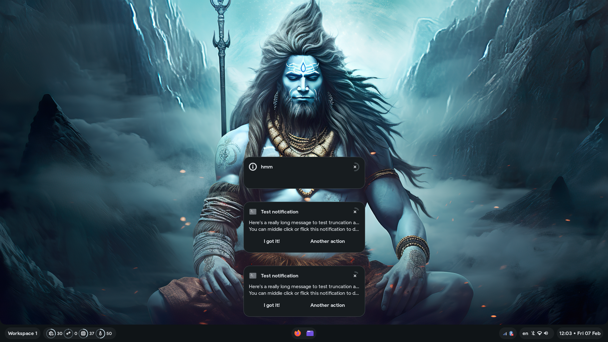

<p align="center">
  
</p>
<p align="center"> <sup>A modular and extensible shell for Hyprland, written on <a href="https://github.com/Fabric-Development/fabric/">Fabric</a>. </sup></p>

<p align="center">

<a href="https://github.com/S4NKALP/Modus/graphs/contributors">
 </a>

<a href="https://github.com/S4NKALP/Modus/stargazers">
</a>

<a href="https://github.com/S4NKALP/Modus/network/members">
 </a>

<a href="https://github.com/S4NKALP/Modus/watchers">
 </a>

<a href="https://github.com/S4NKALP/Modus/pulse">
 </a>
</p>

<br>

<figure>
  
  <br/>
</figure>
<br>

> [!WARNING]
> This configuration is tailored to my preferences with little regard for others. It's not designed to be "good"—just comfortable for me.

<h2><sub></sub> Installation</h2>

> [!NOTE]
> You need a functioning Hyprland installation.

### Arch Linux

> [!NOTE]
> You need to clone it into the Home directory.

> [!TIP]
> This command also works for updating an existing installation!

```bash
curl -fsSL https://raw.githubusercontent.com/S4NKALP/Modus/main/install.sh | bash
```

### Manual Installation

1. Dependencies:

```sh
fabric fabric-cli gnome-bluetooth-3.0 wf-recorder cliphist wl-clipboard grimblast power-profile-daemon adw-gtk-theme brightnessctl swww hypridle hyprlock imagemagick libnotify swappy libadwaita wlinhibit
```

```sh
python-materialyoucolor-git python-pillow python-toml python-ijson python-setproctitle python-requests python-numpy python-pywayland python-pyxdg
```

```sh
ttf-font-awesome otf-font-awesome ttf-material-symbols-variable-git ttf-google-sans ttf-opensans ttf-robot
```

- Icon:

```sh
git clone https://github.com/vinceliuice/Tela-icon-theme
cd Tela-icon-theme
./install.sh nord
```

<h2><sub></sub> Screenshots</h2>

<table align="center">

  <tr>
    <td colspan="1"></td>
    <td colspan="1"></td>
    <td colspan="1"></td>
  </tr>
<tr>
    <td colspan="1"></td>
    <td colspan="1"></td>
    <td colspan="1"></td>
</tr>
<tr>
    <td colspan="1"></td>
    <td colspan="1"></td>
    <td colspan="1"></td>
</tr>

</table>

<h2><sub></sub> Todo</h2>

- [x] App Launcher
- [x] Power Menu
- [x] Wallpaper Picker
- [x] Todo
- [x] Bluetooth Manager
- [x] Clipboard Manager
- [x] OSD
- [x] Sh Runner
- [x] Emoji Picker
- [x] Update Screenshot
- [x] Installation script
- [x] Network Manager
- [x] Calendar
- [x] Power Manager
- [x] Dock
- [x] Web search in Launcher
- [ ] Notification Panel
- [ ] Improve CSS Styling
- [ ] Update Screenshot

## Special Thanks

A big thank you to the following people for their incredible help with code and creative ideas. Your help made a real difference!

- [darsh](https://github.com/its-darsh): for creating Fabric, which made everything possible.
- [gummy bear album](https://github.com/muhchaudhary): for sharing fantastic code snippets that saved me time and effort.
- [axenide](https://github.com/Axenide): for the amazing config that not only inspired parts of mine but also provided some gems I couldn’t resist borrowing.

I truly appreciate your support
